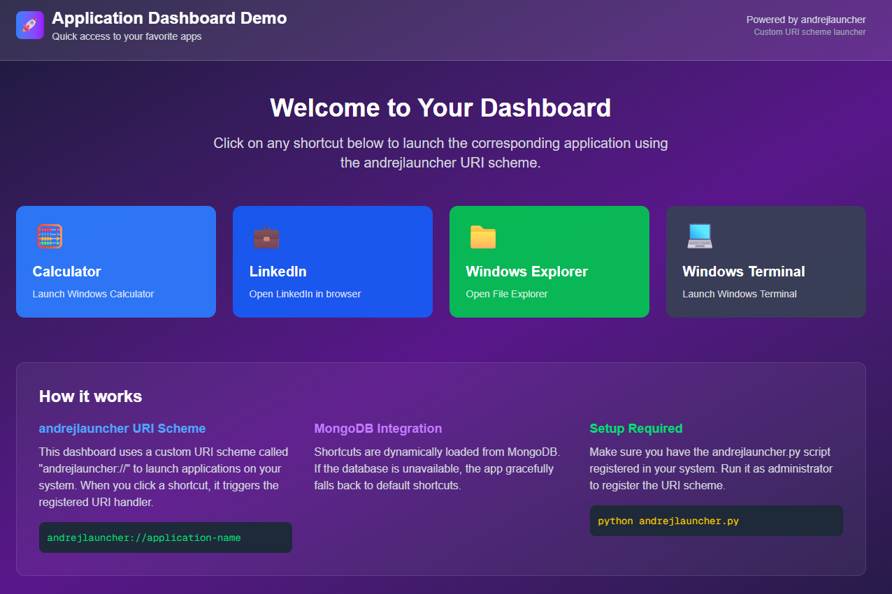

# Application Dashboard

A beautiful Next.js dashboard that provides quick access to applications using the `andrejlauncher://` URI scheme.



## Prerequisites

Before using this dashboard, you need to set up:

### 1. andrejlauncher URI Scheme
1. **Install Python** (if not already installed)
2. **Run the andrejlauncher.py script as Administrator**:
   ```bash
   python andrejlauncher.py
   ```
3. **Verify the URI scheme is registered** by testing with:
   ```
   andrejlauncher://test
   ```

### 2. MongoDB (Optional but Recommended)
The dashboard can work with or without MongoDB:
- **With MongoDB**: Shortcuts are stored in the database and can be managed dynamically
- **Without MongoDB**: Uses fallback shortcuts (still fully functional)

**Quick Setup Options:**

**Option A: Automated Setup (Recommended)**
```bash
npm run setup-mongodb
```

**Option B: Docker (Alternative)**
```bash
docker-compose up -d
```

**Option C: Manual Installation**
- Install MongoDB Community Server
- Or use MongoDB Atlas (cloud service)

## Getting Started

### Installation

1. **Clone or download this project**
2. **Install dependencies**:
   ```bash
   npm install
   ```

### Development

1. **Start the development server**:
   ```bash
   npm run dev
   ```

2. **Open your browser** and navigate to `http://localhost:3000`

3. **Test the shortcuts** by clicking on them - they should trigger the andrejlauncher URI scheme

### Building for Production

1. **Build the application**:
   ```bash
   npm run build
   ```

2. **Start the production server**:
   ```bash
   npm start
   ```

## How It Works

### URI Scheme Integration

The dashboard uses the `andrejlauncher://` URI scheme to launch applications. When you click a shortcut:

1. The dashboard creates a temporary `<a>` element
2. Sets the `href` to the appropriate URI (e.g., `andrejlauncher://calculator`)
3. Programmatically clicks the link to trigger the URI scheme
4. The andrejlauncher script receives the URI and launches the corresponding application

### MongoDB Integration

The dashboard dynamically loads shortcuts from MongoDB with graceful fallback:

1. **Primary**: Fetches shortcuts from `/api/shortcuts` endpoint
2. **Fallback**: Uses predefined shortcuts if MongoDB is unavailable
3. **Loading States**: Shows loading spinner while fetching data
4. **Error Handling**: Displays error message and continues with fallback

**Database Schema:**
- `id`: Unique identifier for the shortcut
- `name`: Display name
- `description`: Short description
- `icon`: Emoji or icon representation
- `uri`: The URI to launch (andrejlauncher:// or https://)
- `color`: Tailwind CSS color classes
- `order`: Display order
- `isActive`: Whether the shortcut is active

### Current Shortcuts

The dashboard includes these pre-configured shortcuts:

| Application | URI | Description |
|-------------|-----|-------------|
| Calculator | `andrejlauncher://calculator` | Launch Windows Calculator |
| LinkedIn | `https://www.linkedin.com/` | Open LinkedIn in browser |
| Windows Explorer | `andrejlauncher://explorer` | Open File Explorer |
| Windows Terminal | `andrejlauncher://terminal` | Launch Windows Terminal |

## Customization

### Managing Shortcuts

**Via API (Recommended):**
```bash
# Add a new shortcut
curl -X POST http://localhost:3000/api/shortcuts \
  -H "Content-Type: application/json" \
  -d '{
    "id": "notepad",
    "name": "Notepad",
    "description": "Launch Windows Notepad",
    "icon": "📝",
    "uri": "andrejlauncher://notepad",
    "color": "bg-yellow-500 hover:bg-yellow-600",
    "order": 5,
    "isActive": true
  }'

# Get all shortcuts
curl http://localhost:3000/api/shortcuts
```

**Via Database:**
```bash
# Connect to MongoDB
mongosh mongodb://localhost:27017/dashboard-app

# Insert a new shortcut
db.shortcuts.insertOne({
  id: "notepad",
  name: "Notepad",
  description: "Launch Windows Notepad",
  icon: "📝",
  uri: "andrejlauncher://notepad",
  color: "bg-yellow-500 hover:bg-yellow-600",
  order: 5,
  isActive: true,
  createdAt: new Date(),
  updatedAt: new Date()
})
```

### Adding New Shortcuts (Fallback)

```typescript
const shortcuts: Shortcut[] = [
  // ... existing shortcuts
  {
    id: 'your-app',
    name: 'Your App',
    description: 'Launch your application',
    icon: '🎯',
    uri: 'andrejlauncher://your-app',
    color: 'bg-purple-500 hover:bg-purple-600'
  }
];
```

### Modifying the Design

The dashboard uses Tailwind CSS for styling. You can customize:

- **Colors**: Modify the `color` property in shortcuts or update the gradient classes
- **Layout**: Adjust the grid layout in the shortcuts section
- **Animations**: Modify the transition classes for different effects

## Technical Details

### Tech Stack

- **Framework**: Next.js 15 with App Router
- **Language**: TypeScript
- **Styling**: Tailwind CSS
- **Build Tool**: Turbopack
- **Linting**: ESLint

### File Structure

```
src/
├── app/
│   ├── page.tsx          # Main dashboard component
│   ├── layout.tsx        # Root layout
│   └── globals.css       # Global styles
```

### Key Components

- **Dashboard**: Main component with shortcuts grid
- **Shortcut Interface**: TypeScript interface for shortcut configuration
- **Click Handler**: Manages URI scheme triggering and visual feedback

## Troubleshooting

### Shortcuts Not Working

1. **Check andrejlauncher registration**:
   - Ensure you ran `python andrejlauncher.py` as Administrator
   - Test with `andrejlauncher://test` in your browser

2. **Browser security**:
   - Some browsers may block custom URI schemes
   - Try clicking the shortcuts multiple times
   - Check browser console for any errors

3. **URI scheme format**:
   - Ensure the URI format is correct: `andrejlauncher://application-name`
   - Check that the andrejlauncher script can handle the specific application names

## Contributing

Feel free to contribute to this project by:

1. Adding new shortcut configurations
2. Improving the UI/UX design
3. Adding new features like shortcut categories or search

## License

This project is open source and available under the MIT License.
